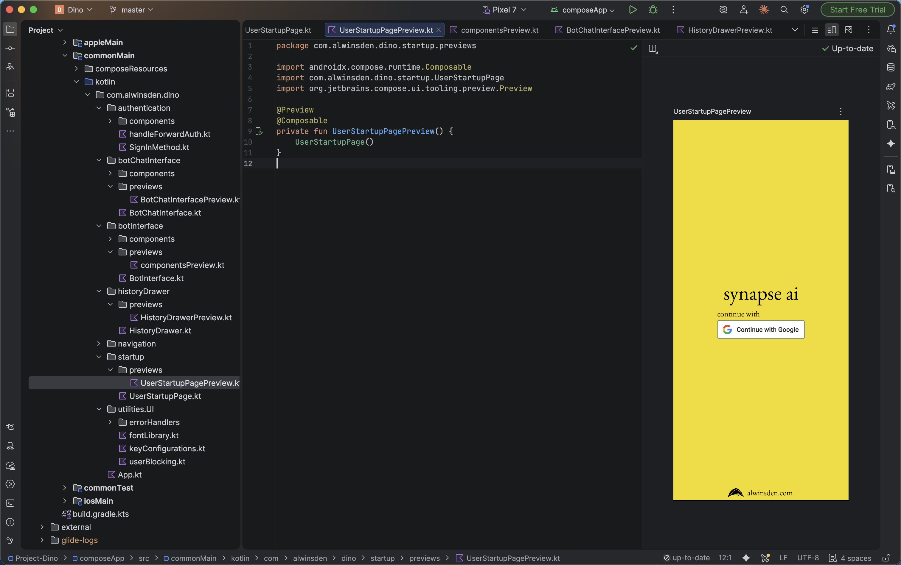

:::info
This is the 2nd article in **Understanding KMP** series. Checkout the previous one [here](/articles/kmp-gauth-multiplatform)!
:::

Since the last post, a lot has changed on Project Dino, now renamed to [Synapse](https://github.com/alwinsDen/synapse-ai). The intense white theme has shifted to (or more like in process) adopting a bright, calm  yellow inspired from [_Pluribus(2025)_](<https://en.wikipedia.org/wiki/Pluribus_(TV_series)>). Last article's code references have been updated.

### Difference between @Preview & Live Edits

Android Studio comes with manual/automated live edits, which when user makes changes to code, reflects those in a running emulator, without needing recompliation (\*generally).

But what if the component is nested deep in a parent page that can be accessed only by authentication? What if its visible only on a specific user action like a pop-up or a toast? So, if only using Live Edits, as a dev I would have to manually trigger these flows _every single time_ or add in testing code to make this specific component always visible, not forgetting the huge resource footprint with a running emulator.

The biggest sell of Previews? _**Isolation.**_

The above shows login page in Preview mode. Since Previews are purely UX related feature, they don't have to rely any kind of developer added component conditions.
